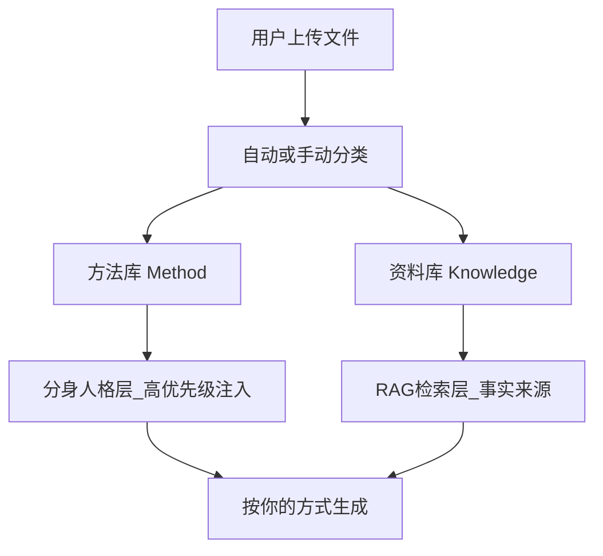
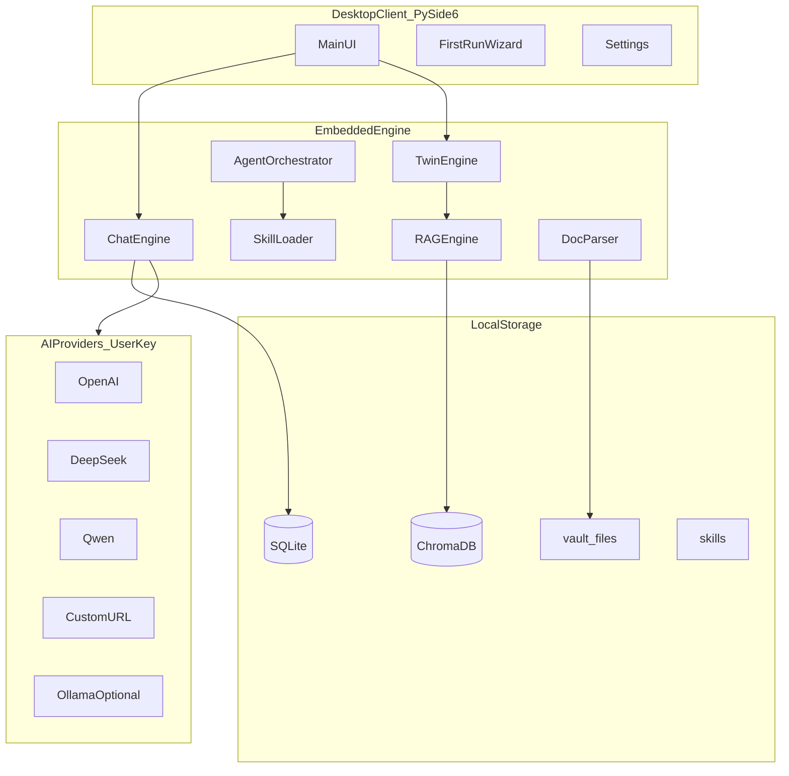
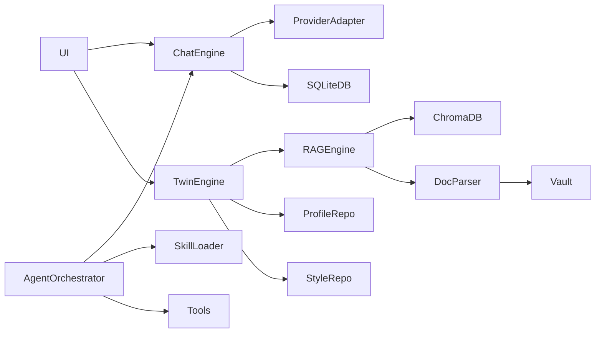

# LocalMind（智匣）产品与技术设计文档

> 版本：v1.0  
> 状态：可开工  
> 目标平台：Windows / macOS / Linux

---

## 目录

1. [产品概述](#1-产品概述)
2. [产品灵魂](#2-产品灵魂不断模仿自己的本地人)
3. [用户上手流程](#3-用户上手流程开箱即用)
4. [双库模型](#4-双库模型核心产品设计)
5. [功能模块规格](#5-功能模块规格)
6. [系统架构](#6-系统架构)
7. [技术选型](#7-技术选型)
8. [本地数据目录](#8-本地数据目录)
9. [数据库设计概要](#9-数据库设计概要)
10. [界面结构](#10-界面结构)
11. [安全与隐私](#11-安全与隐私)
12. [MVP 分期与验收标准](#12-mvp-分期与验收标准)
13. [代码仓库结构](#13-代码仓库结构)
14. [关键接口草案](#14-关键接口草案)
15. [非功能需求](#15-非功能需求)
16. [风险与对策](#16-风险与对策)
17. [术语表](#17-术语表)

---

## 1. 产品概述

### 1.1 基本信息

| 项目 | 内容 |
|------|------|
| 产品名称 | **LocalMind（智匣）** |
| 产品形态 | 跨平台桌面客户端（单安装包） |
| 一句话定义 | 一个住在用户电脑里的 AI 数字分身——用户上传自己的工作资料和方法文档，配置自购 AI Key，即可在本地获得一个越来越像自己的 AI 同事 |
| Slogan | **下载一个越来越像你的本地同事** |

### 1.2 核心差异

| 维度 | 普通 AI 客户端 | LocalMind |
|------|---------------|-----------|
| 个性化 | 通用助手，人人一样 | 只属于你的分身，用你的文档长大 |
| 上手成本 | 需要反复教 prompt | 上传方法文档即定义「你怎么做事」 |
| 数据归属 | 多在云端 | 资料、聊天、索引 100% 本地 |
| 产品气质 | 工具型 | 同事型——替你用你的方式思考和输出 |

### 1.3 目标用户

- **首要场景**：产品经理（PRD、评审、竞品、会议纪要）
- **可扩展场景**：研发、运营、管理者及任何知识工作者
- **使用环境**：个人电脑本地安装，配置自购 AI 厂商 Key 后即用

### 1.4 目标平台

- Windows 10+
- macOS 12+
- Linux（Ubuntu 22.04+ 及主流发行版）

MVP 起即按跨平台架构设计；安装包分阶段在各平台发布（详见第 12 章）。

---

## 2. 产品灵魂：「不断模仿自己的本地人」

### 2.1 核心隐喻

用户不是在「配置 AI」，而是在 **把自己的工作方法装进一台本地电脑里**。

「本地人」的含义：**住在你电脑里的那个你**——一个不断模仿用户本人的数字分身，而非地域意义上的「本地人」。

### 2.2 分身模仿的五类信息

| 类型 | 含义 | 主要来源 |
|------|------|----------|
| 知识 | 你懂什么 | 项目文档、历史产出、参考资料 |
| 风格 | 你怎么写 | 语气、格式、代表作 |
| 习惯 | 你怎么做事 | 先问背景还是先结论、常用结构 |
| 决策模式 | 你怎么选 | 成本优先还是体验优先等原则 |
| 上下文 | 你最近在忙什么 | 会话记录、工作记忆 |

### 2.3 用户极简公式

```
分身 = 工作方法文档（怎么做事）
     + 工作资料（知道什么）
     + 本地 RAG（随时调用）
     + 用户自购 AI Key（生成能力）
```

### 2.4 冷启动策略

**不依赖聊很多天。** 用户上传方法文档和 3–5 份代表作当天即可获得「像样」的分身体验。聊天记录和反馈闭环用于持续优化，而非唯一养料。

### 2.5 用户使用阶段感知

| 阶段 | 用户感受 |
|------|----------|
| 第 1 天 | 像聪明的陌生人，但肯读我的文档 |
| 第 7 天 | 写的东西开始像我团队的口径 |
| 第 30 天 | 不用重复讲背景，它知道项目历史和我的偏好 |
| 第 90 天 | 让它「替我回邮件」，输出接近本人风格 |

---

## 3. 用户上手流程（开箱即用）

### 3.1 流程图


### 3.2 三步上手

用户只需三步，**无第四步**：

1. **配置 AI 提供商**（Key + Base URL + 默认模型）
2. **上传文件**（工作资料 + 工作方法文档）
3. **直接对话**

### 3.3 用户不需要做的事

- 安装 Python、Docker、独立数据库
- 部署任何后端服务
- 配置 Ollama（可选，非必须）
- 编写 prompt 或训练模型

### 3.4 首次上传推荐清单

向导内提供模板下载，引导用户准备：

| 类型 | 示例文件 | 分身学到什么 |
|------|----------|--------------|
| 工作方法（优先） | PRD 模板、评审 checklist、SOP、写作规范、决策原则 | 怎么做事、怎么输出 |
| 工作资料 | 当前项目 PRD、会议纪要、竞品分析、内部规范 | 知道什么、项目背景 |
| 代表作 | 用户认可的 3–5 份历史产出 | 风格样本 |

### 3.5 典型使用场景（产品经理）

**场景：评审需求**

1. 用户已上传 `我的需求评审方法.md` 和当前项目 PRD
2. 用户输入：「帮我评审这个登录优化需求」
3. 分身从方法库拉评审原则，从资料库拉 PRD 上下文
4. 输出按用户模板结构的评审意见，并标注引用来源

---

## 4. 双库模型（核心产品设计）

### 4.1 设计理念

资料文档回答「**这件事是什么**」；方法文档回答「**这种事我会怎么处理**」。

方法库是分身的「操作系统」；资料库是分身的「事实记忆」。

### 4.2 架构图



### 4.3 双库对比

| 库 | 标签 `doc_type` | 用途 | 检索策略 |
|----|-----------------|------|----------|
| 方法库 | `method` | 流程、模板、原则、风格 | 生成前优先注入，高权重 |
| 资料库 | `knowledge` | 项目事实、参考资料 | RAG Top-K 语义 + 关键词检索 |

### 4.4 文件分类方式

MVP 支持两种方式，可并存：

1. **手动分类**：上传时用户选择「方法 / 资料」
2. **自动规则**：文件名或正文含以下关键词时归入方法库：
   - `模板`、`SOP`、`原则`、`规范`、`checklist`、`流程`、`指南`

用户可在文件管理界面随时修改分类。

### 4.5 物理与逻辑存储

- **物理**：所有原文件存入 `vault/{workspace_id}/{file_id}/`
- **逻辑**：按 `doc_type` 写入不同 ChromaDB collection 或同一 collection 带 metadata 过滤
- **元数据**：`files` 表记录 `doc_type`、`status`、`chunk_count` 等

---

## 5. 功能模块规格

### 5.1 AI 提供商管理

#### 5.1.1 协议

统一采用 **OpenAI 兼容 API**，一个适配器覆盖多厂商。

#### 5.1.2 支持厂商

| 厂商 | Base URL 示例 |
|------|---------------|
| OpenAI | `https://api.openai.com/v1` |
| DeepSeek | `https://api.deepseek.com/v1` |
| 通义千问 | `https://dashscope.aliyuncs.com/compatible-mode/v1` |
| 智谱 | `https://open.bigmodel.cn/api/paas/v4` |
| Moonshot | `https://api.moonshot.cn/v1` |
| 自定义 | 用户填写（私有部署、中转站） |
| Ollama（可选） | `http://localhost:11434/v1`（本地，免 Key） |

#### 5.1.3 配置字段

| 字段 | 类型 | 说明 |
|------|------|------|
| `id` | UUID | 主键 |
| `name` | string | 显示名称 |
| `base_url` | string | API 地址 |
| `api_key` | string | AES 加密存储 |
| `default_chat_model` | string | 默认对话模型 |
| `embed_model` | string | 默认 Embedding 模型 |
| `max_tokens` | int | 最大输出 token |
| `is_default` | bool | 是否默认提供商 |

#### 5.1.4 能力要求

- 多提供商并存
- 一键连通性测试
- 对话模型与 Embedding 模型可来自不同提供商
- 设置页明确提示：Embedding 调用同样消耗用户 Key

---

### 5.2 对话与自动存储

#### 5.2.1 核心能力

- 流式对话输出
- 多会话管理，支持工作区隔离
- **每条消息实时写入 SQLite**（发送后 500ms 内落库，不等对话结束）
- 会话全文搜索
- 导出为 Markdown
- 附件存入 vault，可选同步入库索引

#### 5.2.2 对话挂接项

单次对话可挂接：

- 方法库 + 资料库（双库 RAG）
- Skill（技能包）
- Agent（多步自主任务）
- 指定 Provider / 模型

#### 5.2.3 消息结构

每条消息记录：

- `role`（user / assistant / system / tool）
- `content`（正文）
- `model`（使用的模型）
- `rag_sources_json`（引用来源列表）
- `skill_id` / `agent_run_id`（可选关联）

---

### 5.3 知识库与 RAG

#### 5.3.1 入库流水线

```
上传 → vault 原文件落盘 → 文档解析 → 文本分块 → Embedding 向量化 → 写入向量索引 → 更新 files 状态
```

#### 5.3.2 支持格式（MVP）

| 格式 | 解析库 |
|------|--------|
| PDF | pypdf |
| Word (.docx) | python-docx |
| Excel (.xlsx) | openpyxl |
| Markdown | markdown |
| 纯文本 / 代码 | 内置 |

#### 5.3.3 分块策略

- 块大小：512–1024 token（可配置）
- 保留标题层级作为 chunk metadata
- 记录 `file_id`、`page`、`section` 用于引用溯源

#### 5.3.4 检索策略（混合 RAG）

1. **向量检索**：语义相似 Top-K
2. **BM25 关键词**：专有名词、代码符号、精确匹配
3. **元数据过滤**：`doc_type`、工作区、文件类型
4. **Rerank**（可选）：用同一 Provider 的轻量模型重排

#### 5.3.5 回答展示

- 展示引用卡片：文件名 + 页码/段落
- 点击跳转右侧原文预览
- 提供开关：「仅依据知识库回答」（减少幻觉）

#### 5.3.6 文件状态

| 状态 | 含义 |
|------|------|
| `pending` | 等待处理 |
| `parsing` | 解析中 |
| `embedding` | 向量化中 |
| `ready` | 已入库 |
| `failed` | 失败（展示原因，支持重试） |

---

### 5.4 分身引擎

分身引擎是 LocalMind 区别于普通 RAG 客户端的核心模块。

#### 5.4.1 组件

| 组件 | 说明 | 数据来源 |
|------|------|----------|
| 用户画像卡 | 角色、项目、原则、禁忌 | 方法库自动提炼 + 用户可编辑 |
| 风格样本库 | 认可的输出范例 | 用户「采纳」的回复 + 上传的代表作 |
| 方法注入器 | 每次生成前注入方法库片段 | 方法库优先检索 |
| 反馈闭环 | 「采纳 / 不像我 / 编辑后存入」 | M3 实现 |

#### 5.4.2 Context 拼装顺序

每次调用 LLM 前，按以下顺序构建 system / context：

1. 系统人设（岗位：产品经理等，可配置）
2. 方法库检索结果（**高权重，优先注入**）
3. 用户画像卡摘要
4. 风格样本 few-shot（1–3 段）
5. 资料库 RAG 检索结果
6. 当前会话最近 N 轮历史

#### 5.4.3 模仿度指标

界面展示分身「模仿度」进度条，由以下因素加权：

- 方法库文档数与 chunk 数
- 资料库文档数
- 风格样本数
- 累计对话轮数
- 用户采纳率（M3+）

---

### 5.5 Skill 系统

#### 5.5.1 定义

本地 Markdown 技能包，结构类似 Cursor Agent Skill。定义特定工作流的指令、触发条件和依赖。

#### 5.5.2 目录结构

```
{data_dir}/skills/{skill_name}/
├── SKILL.md          # 技能主文件（必须）
└── prompts/          # 可选 prompt 模板
```

#### 5.5.3 SKILL.md 格式

```yaml
---
name: prd-review
description: 按用户方法库进行需求评审
triggers: ["评审", "需求", "PRD"]
requires: [method_library]
---

# 需求评审技能

1. 从方法库检索用户评审原则
2. 从资料库检索相关 PRD 上下文
3. 按用户模板输出：背景 / 问题 / 建议 / 风险
4. 每条建议标注引用来源
```

#### 5.5.4 内置技能包（M4）

| Skill | 说明 |
|-------|------|
| `doc-summary` | 文档结构化摘要 |
| `prd-review` | PRD 需求评审 |
| `meeting-agenda` | 会议议程起草 |
| `code-review` | 代码审查（研发场景） |
| `email-draft` | 邮件/消息起草 |

#### 5.5.5 能力要求

- 内置技能随安装包发布
- 支持导入 zip 或文件夹
- 对话时按 triggers 自动匹配，或用户手动选择
- Skill 只读本地文件，默认不访问外网

---

### 5.6 Agent 系统

#### 5.6.1 定义

```
Agent = LLM + 本地工具 + Skill + 双库 RAG
```

#### 5.6.2 内置工具

| 工具 | 说明 | 网络 |
|------|------|------|
| `search_kb` | 检索资料库 | 否 |
| `search_method` | 检索方法库 | 否 |
| `read_file` | 读取 vault 内文件 | 否 |
| `list_files` | 列出工作区文件 | 否 |
| `write_note` | 写入本地笔记 | 否 |
| `run_skill` | 执行指定 Skill | 否 |
| `web_search` | 网页搜索 | 是（**默认关闭**） |

#### 5.6.3 预设 Agent

| Agent | 能力 |
|-------|------|
| 知识助手 | 双库 RAG 问答 + 引用溯源 |
| 文档分析师 | 多文件对比、摘要、结构化输出 |
| 产品经理分身 | 方法库优先 + PRD 评审/起草工作流 |

#### 5.6.4 执行记录

- 每步推理、工具调用、返回结果写入 `agent_runs` 表
- UI 支持展开查看与回放
- 用于审计与调试

---

### 5.7 三层记忆（进阶，M3+）

| 层级 | 名称 | 存储 | 作用 |
|------|------|------|------|
| L1 | 原始记忆 | `messages` 全表 | 完整聊天，可搜索、可导出 |
| L2 | 工作记忆 | 会话摘要 + 近期跨会话摘要 | 保持当前对话连贯，接上近期上下文 |
| L3 | 长期记忆 | 事实卡片写入资料库 | 从旧对话提炼稳定事实，跨会话召回 |

**MVP 策略**：以「双库 + L1 聊天存档」为主；L2/L3 在 M3/M5 分期引入。

---

## 6. 系统架构

### 6.1 总体架构



### 6.2 进程模型

- **单进程桌面应用**：PySide6 主线程 + 后台工作线程
- 引擎内嵌于应用进程，**不暴露独立 HTTP 端口**
- 文档解析、Embedding 在后台线程/线程池执行，UI 显示进度
- 用户无「起服务」感知

### 6.3 模块依赖关系



---

## 7. 技术选型

| 层级 | 选型 | 说明 |
|------|------|------|
| 语言 | Python 3.11+ | AI / RAG / Agent 生态最成熟 |
| UI | PySide6 | 跨平台原生桌面，安装包可控 |
| 元数据库 | SQLite + SQLAlchemy 2.0 | 零配置，内嵌 |
| 向量库 | ChromaDB persistent | 本地持久化，按工作区 collection |
| AI 调用 | openai SDK + httpx | OpenAI 兼容统一适配 |
| 文档解析 | pypdf, python-docx, openpyxl, markdown | MVP 覆盖主流办公格式 |
| Key 加密 | cryptography (Fernet) | 密钥派生自主机指纹 |
| 配置 | pydantic-settings + YAML | 类型安全 |
| 打包 | PyInstaller (Win) / py2app (mac) / AppImage (Linux) | 分平台 CI，M5 统一 |

### 7.1 不选 Java 的理由

LocalMind 的核心链路是 RAG + Skill + Agent + 多格式文档解析 + 多厂商 AI 适配。Python 在该链路有最完整生态，单栈交付速度最快。Java 需大量桥接，不适合 MVP 节奏。

---

## 8. 本地数据目录

### 8.1 默认路径

| 平台 | 默认数据根目录 |
|------|----------------|
| Windows | `%APPDATA%/LocalMind/` |
| macOS | `~/Library/Application Support/LocalMind/` |
| Linux | `~/.local/share/LocalMind/` |

用户可在首次向导或设置页修改。

### 8.2 目录结构

```
LocalMind/
├── localmind.db          # SQLite：元数据、聊天、配置
├── chroma/               # ChromaDB 向量索引
├── vault/                # 上传原文件
│   └── {workspace_id}/
│       └── {file_id}/
│           └── original.pdf
├── skills/               # 用户导入的技能包
├── agents/               # 自定义 Agent YAML 配置
├── exports/              # 用户导出备份
└── secrets.enc           # 加密的 API Key 等敏感信息
```

### 8.3 备份与迁移

- **备份**：复制整个数据目录
- **迁移**：在新机器安装 LocalMind 后，将数据目录粘贴到对应平台默认路径
- **导出**：设置页支持一键打包 `exports/localmind-backup-{date}.zip`

---

## 9. 数据库设计概要

> 完整表结构、字段类型与索引见 [architecture.md](./architecture.md)

### 9.1 核心表清单

| 表名 | 用途 |
|------|------|
| `providers` | AI 厂商配置 |
| `workspaces` | 工作区（项目隔离） |
| `conversations` | 会话 |
| `messages` | 消息（实时写入） |
| `files` | 文件元数据（含 `doc_type`） |
| `chunks` | 文档分块记录 |
| `skills` | 已注册 Skill |
| `agents` | Agent 配置 |
| `agent_runs` | Agent 执行日志 |
| `agent_run_steps` | Agent 每步详情 |
| `user_profile` | 用户画像卡 |
| `style_samples` | 风格样本 |

### 9.2 关键枚举

**`files.doc_type`**

- `method` — 方法库
- `knowledge` — 资料库

**`files.status`**

- `pending` / `parsing` / `embedding` / `ready` / `failed`

---

## 10. 界面结构

### 10.1 整体布局（三栏）

```
┌──────────────┬──────────────────────────────────┬──────────────┐
│  左栏         │  中栏：对话 / Agent 主区          │  右栏         │
│              │                                  │              │
│  工作区列表   │  [消息流 + 引用卡片]              │  文件列表     │
│  会话列表     │                                  │  入库进度     │
│  知识库入口   │  ─────────────────────────────   │  Skill/模型   │
│  Skill       │  [附件][知识库][Skill][Agent]     │  原文预览     │
│  Agent       │  [输入框................][发送]   │              │
│  设置        │                                  │              │
└──────────────┴──────────────────────────────────┴──────────────┘
```

### 10.2 分身状态条

主界面顶部展示：

```
LocalMind 分身    模仿度 ████████░░ 78%    方法库 5 篇 · 资料库 23 篇 · 风格样本 8 条
```

### 10.3 消息操作（M3）

AI 回复下方提供：

- **采纳** — 存入风格样本库
- **不像我，重写** — 带纠正指令重新生成
- **编辑后存入** — 用户修改后存入风格样本库

### 10.4 设置页 Tab

| Tab | 内容 |
|-----|------|
| AI 提供商 | 增删改 Provider、测试连通性 |
| 数据目录 | 查看/迁移数据路径 |
| 知识库管理 | 文件列表、分类修改、重建索引 |
| Skill | 已安装技能、导入 |
| Agent | 预设与自定义 Agent |
| 备份导出 | 一键备份/恢复 |
| 关于 | 版本、开源协议 |

### 10.5 快捷键

| 快捷键 | 功能 |
|--------|------|
| `Ctrl+K` | 全局搜索（聊天 + 双库） |
| `Ctrl+N` | 新建会话 |
| `Ctrl+,` | 打开设置 |

---

## 11. 安全与隐私

### 11.1 数据原则

- 用户文档、聊天记录、向量索引 **默认不上传** 到 LocalMind 或任何第三方
- 仅用户配置的 AI API 调用会将 prompt 内容发送至对应厂商
- 设置页明确展示「哪些数据会离开本机」

### 11.2 密钥安全

- API Key 使用 Fernet 对称加密，存入 `secrets.enc`
- 加密密钥派生自主机指纹（CPU ID + 用户名 + 盐）
- 数据库中 `providers.api_key` 字段仅存加密后的引用或密文

### 11.3 网络安全

- Agent `web_search` 工具 **默认关闭**
- 用户需在设置中显式开启并确认风险提示
- Skill 执行默认只访问本地文件系统

### 11.4 进阶安全（M5+）

- 可选全数据目录加密
- 应用启动可选密码保护
- 开源可审计（建议采用 MIT 或 Apache-2.0 协议）

---

## 12. MVP 分期与验收标准

### 12.1 分期总览

| 阶段 | 周期 | 交付物 | 验收标准 |
|------|------|--------|----------|
| **M1** 基础对话 | 2 周 | 跨平台可运行骨架、首次向导、Provider 配置、流式对话、消息自动存储 | 配置 Key 后能对话；重启后历史完整保留 |
| **M2** 双库 RAG | 2 周 | 文件上传、解析入库、method/knowledge 分类、混合检索、引用溯源 | 上传方法文档后，输出明显遵循用户模板格式 |
| **M3** 分身引擎 | 2 周 | 用户画像卡、方法优先注入、风格样本、采纳/不像我反馈 | 用户纠正后，同类任务输出风格改善 |
| **M4** Skill+Agent | 2 周 | 内置 Skill 包、Agent 编排、工具调用、执行记录 | 一键触发「PRD 评审」等多步任务并成功完成 |
| **M5** 产品化 | 2 周 | 三平台安装包、备份迁移、多工作区、记忆 L2/L3 | 复制数据目录可在另一台机器完整恢复使用 |

### 12.2 最小商业闭环

**M1 + M2** 即可形成：

> 下载 → 配 Key → 传文档 → 获得像自己的 PM 助手

### 12.3 M1 详细任务清单

- [ ] 项目脚手架与 `pyproject.toml`
- [ ] PySide6 主窗口三栏布局
- [ ] 首次启动向导（数据目录 + Provider 配置）
- [ ] Provider CRUD + 连通性测试
- [ ] OpenAI 兼容 Adapter（流式 chat）
- [ ] SQLite 初始化与 migrations
- [ ] 会话列表 + 消息流 UI
- [ ] 消息实时落库
- [ ] 基础设置页

### 12.4 M2 详细任务清单

- [ ] 文件拖拽上传
- [ ] vault 原文件存储
- [ ] PDF/MD/DOCX/TXT 解析器
- [ ] 分块 + Embedding 流水线
- [ ] ChromaDB 索引（按 doc_type）
- [ ] 混合检索实现
- [ ] 对话引用卡片 + 原文预览
- [ ] 文件状态与进度 UI
- [ ] 「仅依据知识库回答」开关

---

## 13. 代码仓库结构

```
localmind/
├── main.py                         # 应用入口
├── pyproject.toml
├── README.md
├── docs/
│   ├── LocalMind-PRD.md            # 本文档
│   └── architecture.md             # 架构与接口详图
├── app/
│   ├── ui/
│   │   ├── main_window.py
│   │   ├── wizard/
│   │   │   └── first_run.py
│   │   ├── chat/
│   │   │   ├── chat_panel.py
│   │   │   └── message_widget.py
│   │   ├── knowledge/
│   │   │   └── file_panel.py
│   │   ├── skills/
│   │   ├── agents/
│   │   └── settings/
│   │       └── provider_settings.py
│   ├── core/
│   │   ├── providers/
│   │   │   ├── base.py
│   │   │   └── openai_compat.py
│   │   ├── chat/
│   │   │   └── chat_engine.py
│   │   ├── twin/
│   │   │   ├── twin_engine.py
│   │   │   └── context_builder.py
│   │   ├── rag/
│   │   │   ├── indexer.py
│   │   │   ├── retriever.py
│   │   │   └── chunker.py
│   │   ├── parser/
│   │   │   ├── pdf_parser.py
│   │   │   ├── docx_parser.py
│   │   │   └── markdown_parser.py
│   │   ├── skills/
│   │   │   └── skill_loader.py
│   │   ├── agents/
│   │   │   └── orchestrator.py
│   │   └── tools/
│   │       ├── search_kb.py
│   │       └── read_file.py
│   ├── db/
│   │   ├── models.py
│   │   ├── repository.py
│   │   └── migrations/
│   └── utils/
│       ├── crypto.py
│       └── paths.py
├── bundled/
│   └── skills/                     # 内置 Skill 包
│       ├── prd-review/
│       └── doc-summary/
└── build/
    ├── windows/
    ├── macos/
    └── linux/
```

---

## 14. 关键接口草案

> 完整接口定义见 [architecture.md](./architecture.md)

### 14.1 LLM Provider 协议

```python
from typing import AsyncIterator, Protocol

class LLMProvider(Protocol):
    async def chat(
        self, messages: list[dict], model: str, stream: bool = True
    ) -> AsyncIterator[str]: ...

    async def embed(
        self, texts: list[str], model: str
    ) -> list[list[float]]: ...

    async def list_models(self) -> list[str]: ...

    async def test_connection(self) -> bool: ...
```

### 14.2 分身 Context 构建

```python
def build_twin_context(query: str, workspace_id: str) -> TwinContext:
    methods = rag.search(query, doc_type="method", top_k=3)
    knowledge = rag.search(query, doc_type="knowledge", top_k=5)
    profile = profile_repo.get(workspace_id)
    styles = style_repo.sample(workspace_id, top_k=2)
    return TwinContext(
        methods=methods,
        knowledge=knowledge,
        profile=profile,
        styles=styles,
    )
```

### 14.3 文档分类

```python
def classify_doc(filename: str, content_preview: str) -> str:
    """返回 'method' 或 'knowledge'"""
    ...
```

---

## 15. 非功能需求

| 指标 | 目标 |
|------|------|
| 冷启动 | 安装到首次对话 < 5 分钟 |
| 消息落库延迟 | 发送后 < 500ms 写入 SQLite |
| 单文件解析 | 10MB PDF < 30s（取决于 Embedding API 响应） |
| 安装包体积 | < 300MB（含 Python 运行时） |
| 最低硬件 | 8GB RAM，2GB 可用磁盘 |
| 推荐硬件 | 16GB RAM，SSD，稳定网络（调用云端 API） |
| 离线能力 | 可浏览历史、搜索已索引知识库；生成回复需 API 或本地 Ollama |

---

## 16. 风险与对策

| 风险 | 影响 | 对策 |
|------|------|------|
| Embedding 消耗用户 Key | 费用超预期 | 设置页明确说明；支持 Ollama 本地 Embedding；批量去重 |
| 方法库自动分类不准 | 分身输出不像用户 | 上传时强制手动标签；支持事后改分类 |
| 跨平台打包复杂 | 延期 | M1–M4 用 `python main.py` 开发；M5 集中处理三平台打包 |
| 分身「像」难量化 | 用户感知弱 | 模仿度仪表盘 + 采纳率统计 + 对比预览 |
| 大文件解析慢 | 体验差 | 后台线程 + 进度条 + 可取消；超大文件提示分批上传 |
| API 厂商限流 | 对话中断 | 重试退避；UI 友好错误提示；支持切换 Provider |

---

## 17. 术语表

| 术语 | 英文 | 定义 |
|------|------|------|
| 分身 | Twin | 基于用户本地文档形成的个性化 AI 人格 |
| 方法库 | Method Library | 存放 SOP、模板、原则、写作规范类文档 |
| 资料库 | Knowledge Library | 存放项目事实、参考资料、历史产出 |
| 模仿度 | Mimicry Score | 方法库规模、风格样本、对话积累的综合指标 |
| Provider | AI Provider | 一个 AI 厂商的 Key + URL + 模型配置 |
| Skill | Skill | 本地 Markdown 定义的可复用工作流技能包 |
| Agent | Agent | 能调用多步工具和 Skill 的自主任务执行器 |
| RAG | Retrieval-Augmented Generation | 检索增强生成，用知识库内容辅助回答 |
| vault | File Vault | 用户上传原文件的本地存储目录 |
| 工作区 | Workspace | 项目级隔离单元，含独立双库与会话 |

---

## 附录 A：内置向导模板文件清单

首次向导提供以下空模板下载：

| 模板文件 | 建议归入 |
|----------|----------|
| `我的需求评审方法.md` | 方法库 |
| `PRD模板.md` | 方法库 |
| `会议纪要模板.md` | 方法库 |
| `写作风格说明.md` | 方法库 |
| `项目背景说明.md` | 资料库 |

---

## 附录 B：文档修订记录

| 版本 | 日期 | 说明 |
|------|------|------|
| v1.0 | 2026-06-09 | 初始版本，可开工 |

---

*本文档为 LocalMind 项目唯一产品与技术设计依据。开发过程中如有变更，请同步更新本文档并记录修订版本。*
