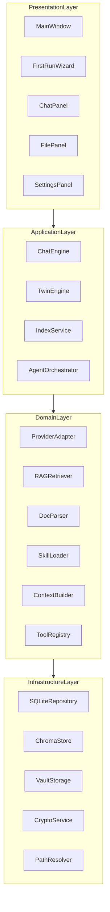
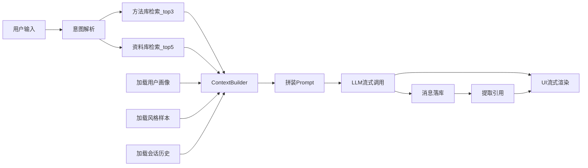
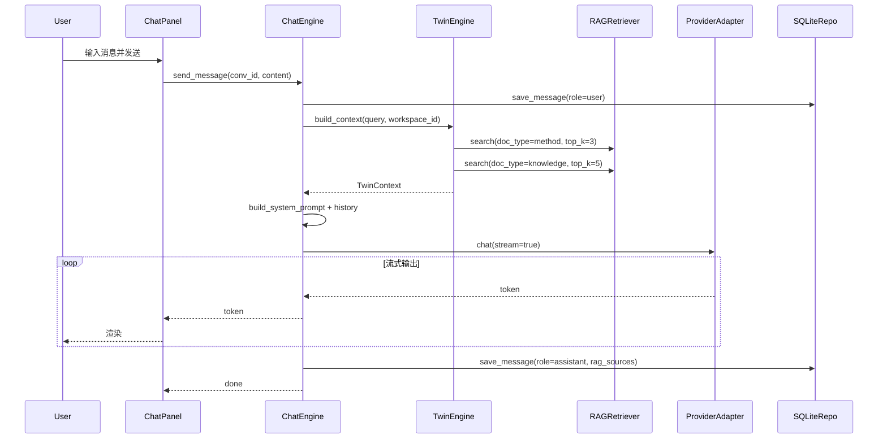
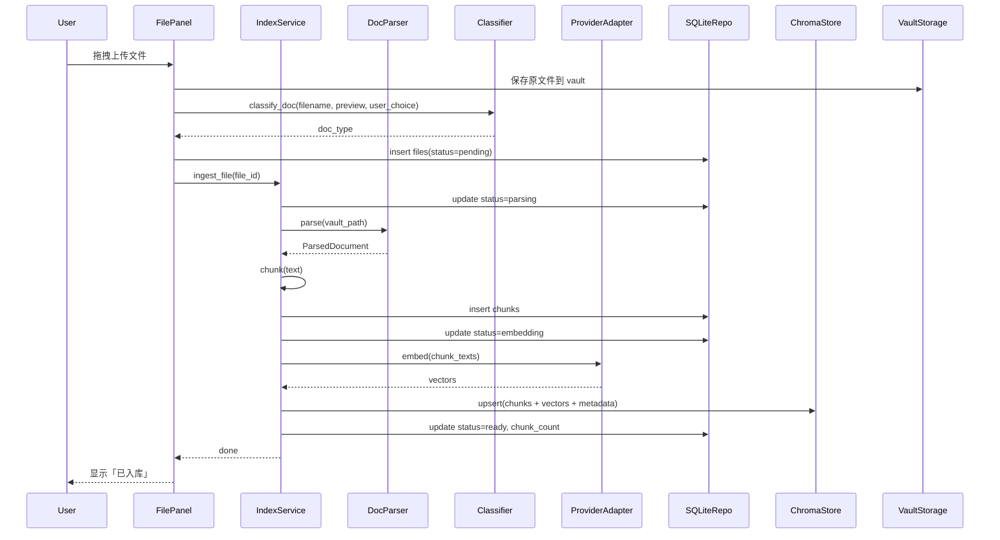
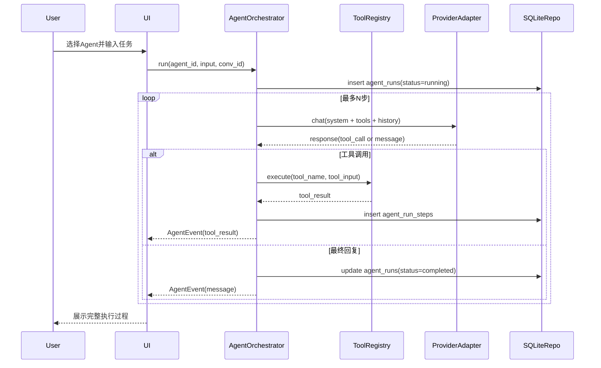
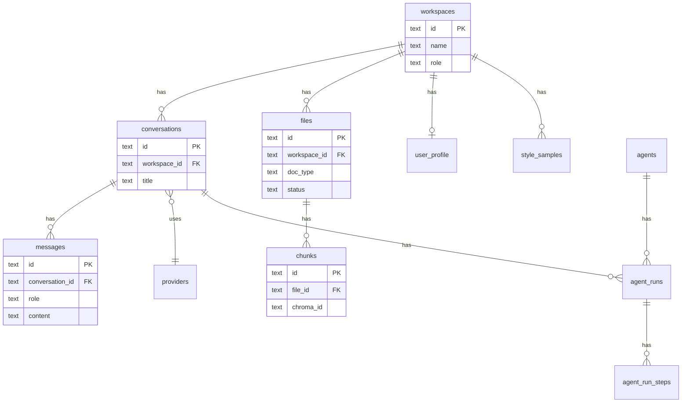

# LocalMind 架构设计文档

> 本文档为 [LocalMind-PRD.md](./LocalMind-PRD.md) 的技术补充，供开发时查阅。  
> 版本：v1.0

---

## 目录

1. [系统分层](#1-系统分层)
2. [核心数据流](#2-核心数据流)
3. [数据库完整表结构](#3-数据库完整表结构)
4. [ChromaDB 索引设计](#4-chromadb-索引设计)
5. [核心模块接口](#5-核心模块接口)
6. [对话请求时序](#6-对话请求时序)
7. [文件入库时序](#7-文件入库时序)
8. [Agent 执行时序](#8-agent-执行时序)
9. [配置与路径](#9-配置与路径)
10. [打包与部署](#10-打包与部署)

---

## 1. 系统分层



### 1.1 分层职责

| 层 | 职责 | 禁止 |
|----|------|------|
| Presentation | UI 渲染、用户事件、状态展示 | 直接调用 AI API、直接操作 ChromaDB |
| Application | 编排业务流程、事务边界 | 包含 UI 逻辑 |
| Domain | 核心业务规则、算法 | 依赖 PySide6 |
| Infrastructure | 持久化、加密、文件 IO | 包含业务规则 |

---

## 2. 核心数据流

### 2.1 双库 + 分身生成流



### 2.2 Context 拼装结构

```
┌─────────────────────────────────────────────┐
│ System Prompt                               │
│  ├─ 岗位人设（产品经理）                      │
│  ├─ 方法库片段（高权重）                      │
│  ├─ 用户画像卡摘要                           │
│  └─ 风格样本 few-shot（1-3段）               │
├─────────────────────────────────────────────┤
│ RAG Context                                 │
│  └─ 资料库检索结果（带 source 标记）           │
├─────────────────────────────────────────────┤
│ Conversation History                        │
│  └─ 最近 N 轮消息（user/assistant）           │
├─────────────────────────────────────────────┤
│ User Message                                │
│  └─ 当前用户输入                             │
└─────────────────────────────────────────────┘
```

### 2.3 Prompt 模板（System 部分草案）

```
你是用户的本地 AI 分身，岗位是{role}。你必须严格遵循用户的方法文档来思考和输出。

## 用户方法（必须遵循）
{method_chunks}

## 用户画像
{profile_summary}

## 用户风格范例
{style_samples}

## 回答要求
1. 优先遵循方法文档中的格式和原则
2. 引用资料库内容时标注来源
3. 语气与风格范例保持一致
4. 不确定时明确说明，不编造
```

---

## 3. 数据库完整表结构

数据库文件：`{data_dir}/localmind.db`  
引擎：SQLite 3，ORM：SQLAlchemy 2.0

### 3.1 providers

```sql
CREATE TABLE providers (
    id              TEXT PRIMARY KEY,
    name            TEXT NOT NULL,
    base_url        TEXT NOT NULL,
    api_key_ref     TEXT NOT NULL,          -- 指向 secrets.enc 中的 key id
    chat_model      TEXT NOT NULL,
    embed_model     TEXT,
    max_tokens      INTEGER DEFAULT 4096,
    is_default      INTEGER DEFAULT 0,      -- 0=false, 1=true
    created_at      TEXT NOT NULL,
    updated_at      TEXT NOT NULL
);
```

### 3.2 workspaces

```sql
CREATE TABLE workspaces (
    id              TEXT PRIMARY KEY,
    name            TEXT NOT NULL,
    role            TEXT DEFAULT 'product_manager',  -- 岗位人设
    description     TEXT,
    is_default      INTEGER DEFAULT 0,
    created_at      TEXT NOT NULL,
    updated_at      TEXT NOT NULL
);
```

### 3.3 conversations

```sql
CREATE TABLE conversations (
    id              TEXT PRIMARY KEY,
    workspace_id    TEXT NOT NULL REFERENCES workspaces(id),
    title           TEXT DEFAULT '新对话',
    provider_id     TEXT REFERENCES providers(id),
    model           TEXT,
    use_knowledge   INTEGER DEFAULT 1,      -- 是否启用知识库
    skill_id        TEXT,
    agent_id        TEXT,
    created_at      TEXT NOT NULL,
    updated_at      TEXT NOT NULL
);
CREATE INDEX idx_conversations_workspace ON conversations(workspace_id);
```

### 3.4 messages

```sql
CREATE TABLE messages (
    id              TEXT PRIMARY KEY,
    conversation_id TEXT NOT NULL REFERENCES conversations(id),
    role            TEXT NOT NULL,          -- user|assistant|system|tool
    content         TEXT NOT NULL,
    model           TEXT,
    tokens          INTEGER,
    rag_sources     TEXT,                   -- JSON: [{file_id, chunk_id, excerpt, page}]
    skill_id        TEXT,
    agent_run_id    TEXT,
    created_at      TEXT NOT NULL
);
CREATE INDEX idx_messages_conversation ON messages(conversation_id);
CREATE INDEX idx_messages_created ON messages(created_at);
```

### 3.5 files

```sql
CREATE TABLE files (
    id              TEXT PRIMARY KEY,
    workspace_id    TEXT NOT NULL REFERENCES workspaces(id),
    filename        TEXT NOT NULL,
    original_name   TEXT NOT NULL,
    mime_type       TEXT,
    size_bytes      INTEGER,
    doc_type        TEXT NOT NULL,          -- method|knowledge
    status          TEXT NOT NULL DEFAULT 'pending',
    error_message   TEXT,
    vault_path      TEXT NOT NULL,
    chunk_count     INTEGER DEFAULT 0,
    created_at      TEXT NOT NULL,
    updated_at      TEXT NOT NULL
);
CREATE INDEX idx_files_workspace ON files(workspace_id);
CREATE INDEX idx_files_doc_type ON files(doc_type);
CREATE INDEX idx_files_status ON files(status);
```

### 3.6 chunks

```sql
CREATE TABLE chunks (
    id              TEXT PRIMARY KEY,
    file_id         TEXT NOT NULL REFERENCES files(id),
    workspace_id    TEXT NOT NULL REFERENCES workspaces(id),
    doc_type        TEXT NOT NULL,
    content         TEXT NOT NULL,
    token_count     INTEGER,
    chunk_index     INTEGER NOT NULL,
    page            INTEGER,
    section         TEXT,
    chroma_id       TEXT,                   -- ChromaDB 中的 id
    created_at      TEXT NOT NULL
);
CREATE INDEX idx_chunks_file ON chunks(file_id);
CREATE INDEX idx_chunks_workspace ON chunks(workspace_id);
```

### 3.7 skills

```sql
CREATE TABLE skills (
    id              TEXT PRIMARY KEY,
    name            TEXT NOT NULL UNIQUE,
    description     TEXT,
    triggers        TEXT,                   -- JSON array
    requires        TEXT,                   -- JSON array
    skill_path      TEXT NOT NULL,
    is_builtin      INTEGER DEFAULT 0,
    enabled         INTEGER DEFAULT 1,
    created_at      TEXT NOT NULL
);
```

### 3.8 agents

```sql
CREATE TABLE agents (
    id              TEXT PRIMARY KEY,
    name            TEXT NOT NULL,
    description     TEXT,
    system_prompt   TEXT,
    tools           TEXT,                   -- JSON array of tool names
    skill_ids       TEXT,                   -- JSON array
    provider_id     TEXT REFERENCES providers(id),
    model           TEXT,
    is_builtin      INTEGER DEFAULT 0,
    created_at      TEXT NOT NULL
);
```

### 3.9 agent_runs

```sql
CREATE TABLE agent_runs (
    id              TEXT PRIMARY KEY,
    agent_id        TEXT NOT NULL REFERENCES agents(id),
    conversation_id TEXT REFERENCES conversations(id),
    workspace_id    TEXT NOT NULL REFERENCES workspaces(id),
    status          TEXT NOT NULL,          -- running|completed|failed|cancelled
    input           TEXT NOT NULL,
    output          TEXT,
    error_message   TEXT,
    started_at      TEXT NOT NULL,
    finished_at     TEXT
);
```

### 3.10 agent_run_steps

```sql
CREATE TABLE agent_run_steps (
    id              TEXT PRIMARY KEY,
    run_id          TEXT NOT NULL REFERENCES agent_runs(id),
    step_index      INTEGER NOT NULL,
    step_type       TEXT NOT NULL,          -- thought|tool_call|tool_result|message
    tool_name       TEXT,
    tool_input      TEXT,                   -- JSON
    tool_output     TEXT,                   -- JSON
    content         TEXT,
    created_at      TEXT NOT NULL
);
CREATE INDEX idx_agent_run_steps_run ON agent_run_steps(run_id);
```

### 3.11 user_profile

```sql
CREATE TABLE user_profile (
    id              TEXT PRIMARY KEY,
    workspace_id    TEXT NOT NULL UNIQUE REFERENCES workspaces(id),
    role            TEXT,
    summary         TEXT,                   -- 自动提炼的画像摘要
    principles      TEXT,                   -- JSON: 工作原则列表
    taboos          TEXT,                   -- JSON: 禁忌/避免事项
    updated_at      TEXT NOT NULL
);
```

### 3.12 style_samples

```sql
CREATE TABLE style_samples (
    id              TEXT PRIMARY KEY,
    workspace_id    TEXT NOT NULL REFERENCES workspaces(id),
    title           TEXT,
    content         TEXT NOT NULL,
    source          TEXT,                   -- adopted|uploaded|edited
    source_message_id TEXT,
    created_at      TEXT NOT NULL
);
CREATE INDEX idx_style_samples_workspace ON style_samples(workspace_id);
```

### 3.13 conversation_summaries（L2 记忆，M5）

```sql
CREATE TABLE conversation_summaries (
    id              TEXT PRIMARY KEY,
    conversation_id TEXT NOT NULL REFERENCES conversations(id),
    workspace_id    TEXT NOT NULL REFERENCES workspaces(id),
    summary         TEXT NOT NULL,
    created_at      TEXT NOT NULL
);
```

### 3.14 fact_cards（L3 记忆，M5）

```sql
CREATE TABLE fact_cards (
    id              TEXT PRIMARY KEY,
    workspace_id    TEXT NOT NULL REFERENCES workspaces(id),
    fact            TEXT NOT NULL,
    source          TEXT,                   -- conversation|manual|extracted
    source_id       TEXT,
    created_at      TEXT NOT NULL
);
```

---

## 4. ChromaDB 索引设计

### 4.1 Collection 策略

每个 workspace 一个 collection：

```
collection_name = "ws_{workspace_id}"
```

通过 metadata 区分方法库与资料库：

```python
metadata = {
    "workspace_id": workspace_id,
    "file_id": file_id,
    "chunk_id": chunk_id,
    "doc_type": "method",       # or "knowledge"
    "filename": "PRD模板.md",
    "page": 1,
    "section": "评审原则",
}
```

### 4.2 检索参数

| 参数 | 方法库 | 资料库 |
|------|--------|--------|
| `top_k` | 3 | 5 |
| `doc_type` filter | `method` | `knowledge` |
| 最低相似度阈值 | 0.3 | 0.25 |

### 4.3 重建索引

当 Embedding 模型变更时，用户可在设置页触发「重建索引」：

```
遍历 files(status=ready) → 重新 embed → 更新 chroma + chunks
```

---

## 5. 核心模块接口

### 5.1 ProviderAdapter

```python
# app/core/providers/base.py

from dataclasses import dataclass
from typing import AsyncIterator, Protocol

@dataclass
class ChatMessage:
    role: str
    content: str

@dataclass
class ProviderConfig:
    id: str
    name: str
    base_url: str
    api_key: str
    chat_model: str
    embed_model: str | None
    max_tokens: int

class LLMProvider(Protocol):
    async def chat(
        self,
        messages: list[ChatMessage],
        model: str | None = None,
        stream: bool = True,
        temperature: float = 0.7,
    ) -> AsyncIterator[str]: ...

    async def chat_complete(
        self,
        messages: list[ChatMessage],
        model: str | None = None,
        temperature: float = 0.7,
    ) -> str: ...

    async def embed(
        self,
        texts: list[str],
        model: str | None = None,
    ) -> list[list[float]]: ...

    async def list_models(self) -> list[str]: ...

    async def test_connection(self) -> bool: ...
```

### 5.2 RAGRetriever

```python
# app/core/rag/retriever.py

from dataclasses import dataclass

@dataclass
class RetrievalResult:
    chunk_id: str
    file_id: str
    filename: str
    doc_type: str
    content: str
    score: float
    page: int | None
    section: str | None

class RAGRetriever:
    def search(
        self,
        query: str,
        workspace_id: str,
        doc_type: str | None = None,
        top_k: int = 5,
    ) -> list[RetrievalResult]: ...

    def hybrid_search(
        self,
        query: str,
        workspace_id: str,
        doc_type: str | None = None,
        top_k: int = 5,
    ) -> list[RetrievalResult]:
        """向量 + BM25 混合检索"""
        ...
```

### 5.3 IndexService

```python
# app/core/rag/indexer.py

class IndexService:
    async def ingest_file(self, file_id: str) -> None:
        """完整入库流水线：解析 → 分块 → embed → 索引"""
        ...

    async def reindex_workspace(self, workspace_id: str) -> None:
        """重建工作区全部索引"""
        ...

    async def delete_file_index(self, file_id: str) -> None:
        """删除文件对应的 chunks 和向量"""
        ...
```

### 5.4 TwinEngine

```python
# app/core/twin/twin_engine.py

from dataclasses import dataclass

@dataclass
class TwinContext:
    methods: list[RetrievalResult]
    knowledge: list[RetrievalResult]
    profile_summary: str
    style_samples: list[str]
    role: str

class TwinEngine:
    def build_context(
        self,
        query: str,
        workspace_id: str,
    ) -> TwinContext: ...

    def build_system_prompt(self, ctx: TwinContext) -> str: ...

    def calc_mimicry_score(self, workspace_id: str) -> int:
        """返回 0-100 的模仿度分数"""
        ...
```

### 5.5 ChatEngine

```python
# app/core/chat/chat_engine.py

class ChatEngine:
    async def send_message(
        self,
        conversation_id: str,
        content: str,
        *,
        use_knowledge: bool = True,
        skill_id: str | None = None,
    ) -> AsyncIterator[str]:
        """流式发送消息，yield 每个 token，完成后自动落库"""
        ...

    async def save_message(
        self,
        conversation_id: str,
        role: str,
        content: str,
        **metadata,
    ) -> str:
        """立即落库，返回 message_id"""
        ...
```

### 5.6 DocParser

```python
# app/core/parser/base.py

from dataclasses import dataclass

@dataclass
class ParsedDocument:
    text: str
    pages: list[str] | None      # PDF 分页文本
    metadata: dict

class DocParser:
    def parse(self, file_path: str, mime_type: str) -> ParsedDocument: ...

    def supported_mimes(self) -> list[str]: ...
```

### 5.7 SkillLoader

```python
# app/core/skills/skill_loader.py

from dataclasses import dataclass

@dataclass
class Skill:
    name: str
    description: str
    triggers: list[str]
    requires: list[str]
    instructions: str
    path: str

class SkillLoader:
    def load_all(self, skills_dir: str) -> list[Skill]: ...

    def match(self, user_input: str, skills: list[Skill]) -> Skill | None: ...
```

### 5.8 AgentOrchestrator

```python
# app/core/agents/orchestrator.py

class AgentOrchestrator:
    async def run(
        self,
        agent_id: str,
        input_text: str,
        conversation_id: str,
        workspace_id: str,
    ) -> AsyncIterator[AgentEvent]:
        """执行 Agent 循环，yield 每步事件供 UI 展示"""
        ...

@dataclass
class AgentEvent:
    type: str           # thought|tool_call|tool_result|message|done|error
    content: str
    tool_name: str | None = None
```

### 5.9 文档分类器

```python
# app/core/rag/classifier.py

METHOD_KEYWORDS = [
    "模板", "sop", "原则", "规范", "checklist",
    "流程", "指南", "template", "method", "guide",
]

def classify_doc(
    filename: str,
    content_preview: str,
    user_choice: str | None = None,
) -> str:
    """
    返回 'method' 或 'knowledge'。
    user_choice 优先；否则按关键词规则自动分类。
    """
    if user_choice in ("method", "knowledge"):
        return user_choice
    text = (filename + " " + content_preview).lower()
    for kw in METHOD_KEYWORDS:
        if kw in text:
            return "method"
    return "knowledge"
```

---

## 6. 对话请求时序



---

## 7. 文件入库时序



---

## 8. Agent 执行时序



---

## 9. 配置与路径

### 9.1 应用配置（config.yaml）

```yaml
app:
  language: zh-CN
  theme: system          # light|dark|system

data:
  dir: ""                # 空则使用平台默认路径

chat:
  history_limit: 20      # 带入上下文的历史消息数
  auto_title: true       # 自动命名会话

rag:
  chunk_size: 800
  chunk_overlap: 100
  method_top_k: 3
  knowledge_top_k: 5

twin:
  style_sample_limit: 3
  mimicry_weights:
    method_files: 30
    knowledge_files: 20
    style_samples: 30
    conversations: 20

agent:
  max_steps: 10
  web_search_enabled: false
```

### 9.2 路径解析（paths.py）

```python
# app/utils/paths.py

import platform
from pathlib import Path

def default_data_dir() -> Path:
    system = platform.system()
    if system == "Windows":
        base = Path(os.environ["APPDATA"])
    elif system == "Darwin":
        base = Path.home() / "Library" / "Application Support"
    else:
        base = Path.home() / ".local" / "share"
    return base / "LocalMind"

def vault_dir(data_dir: Path, workspace_id: str, file_id: str) -> Path:
    return data_dir / "vault" / workspace_id / file_id

def chroma_dir(data_dir: Path) -> Path:
    return data_dir / "chroma"

def skills_dir(data_dir: Path) -> Path:
    return data_dir / "skills"
```

### 9.3 密钥加密（crypto.py）

```python
# app/utils/crypto.py

from cryptography.fernet import Fernet

class SecretStore:
    def __init__(self, data_dir: Path): ...

    def encrypt(self, key_id: str, plaintext: str) -> None: ...

    def decrypt(self, key_id: str) -> str: ...

    def delete(self, key_id: str) -> None: ...
```

加密密钥派生：

```
machine_key = SHA256(cpu_id + username + "localmind-salt-v1")
fernet_key = base64_urlsafe_encode(machine_key[:32])
```

---

## 10. 打包与部署

### 10.1 开发模式启动

```bash
# 安装依赖
pip install -e ".[dev]"

# 启动应用
python main.py
```

### 10.2 三平台打包策略

| 平台 | 工具 | 输出 |
|------|------|------|
| Windows | PyInstaller | `LocalMind-Setup.exe` |
| macOS | py2app 或 PyInstaller | `LocalMind.dmg` |
| Linux | PyInstaller + AppImage | `LocalMind.AppImage` |

### 10.3 打包内置资源

```
bundled/
├── skills/           # 内置 Skill 包
└── templates/        # 向导模板文件
```

首次启动时复制到用户数据目录（若不存在）。

### 10.4 环境变量

| 变量 | 用途 |
|------|------|
| `LOCALMIND_DATA_DIR` | 覆盖默认数据目录（开发用） |
| `LOCALMIND_LOG_LEVEL` | 日志级别：DEBUG/INFO/WARNING |

---

## 附录：ER 图



---

*本文档随开发进展同步更新。表结构变更需同步修改 migrations 及 PRD 第 9 章。*
